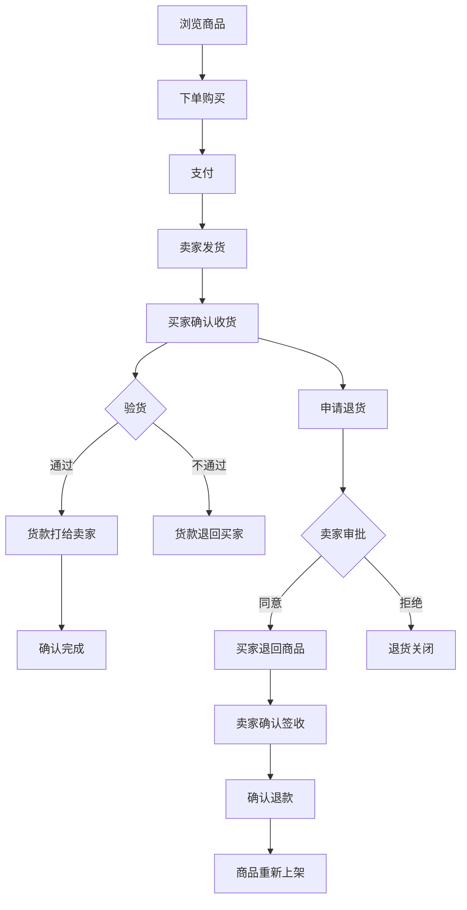

## 1. 产品概述

闲鱼风格二手交易平台 —— 一个面向个人用户的闲置物品买卖平台，核心解决"个人闲置流转"问题。用户可一键发布闲置商品、浏览搜索心仪宝贝、完成下单支付、跟踪物流运输、验货确认、退货退款的全流程交易。

- 目标用户：有闲置物品出售需求的个人卖家 & 寻找高性价比二手商品的买家
- 核心价值：让闲置物品流转更高效、交易更安全、体验更愉悦

## 2. 核心功能

### 2.1 用户角色

| 角色 | 注册方式 | 核心权限 |
|------|----------|----------|
| 买家 | 用户名+密码注册 | 浏览商品、下单购买、验货、退货 |
| 卖家 | 同一账号即可卖 | 发布闲置、管理商品、发货、处理退货 |
| 管理员 | — | 平台数据管理（暂不实现） |

### 2.2 功能模块

1. **首页**：搜索栏、分类导航、商品瀑布流展示、轮播推荐
2. **商品详情页**：图片画廊、价格/成色/描述、卖家信息、立即购买
3. **发布闲置页**：商品信息表单（标题/分类/价格/成色/描述/图片）
4. **订单中心页**：买家订单/卖家订单切换、订单状态筛选
5. **订单详情页**：商品信息、收货信息、物流时间线、操作按钮（支付/发货/验货/完成/退货）
6. **退货管理页**：退货列表、退货详情、退货流程操作
7. **个人中心页**：头像/余额、资料编辑、我的发布

### 2.3 页面详情

| 页面名称 | 模块名称 | 功能描述 |
|----------|----------|----------|
| 首页 | 搜索栏 | 关键词搜索 + 分类下拉筛选 |
| 首页 | 分类标签栏 | 横向滚动分类标签，点击筛选 |
| 首页 | 商品瀑布流 | 卡片式商品展示，图片+标题+价格+成色 |
| 商品详情页 | 图片画廊 | 主图切换 + 缩略图预览 |
| 商品详情页 | 商品信息 | 价格/原价/成色/分类/浏览量 |
| 商品详情页 | 卖家卡片 | 头像/昵称/身份标签 |
| 商品详情页 | 购买操作 | 立即购买按钮 + 收货信息弹窗 |
| 发布闲置页 | 商品表单 | 标题/分类/价格/原价/成色/描述/图片URL |
| 订单中心页 | 角色切换 | 全部/我买到的/我卖出的 标签切换 |
| 订单中心页 | 订单卡片 | 订单号/状态/商品缩略图/价格 |
| 订单详情页 | 订单信息 | 完整订单状态流转 + 收货/联系方式 |
| 订单详情页 | 物流时间线 | 快递公司/运单号 + 物流轨迹 |
| 订单详情页 | 操作区 | 根据订单状态显示支付/发货/收货/验货/完成/退货按钮 |
| 退货管理页 | 退货列表 | 退货单号/状态/商品信息/退货原因 |
| 退货详情页 | 退货流程 | 审批→退回→签收→退款 完整流程 |
| 个人中心页 | 用户信息 | 头像/昵称/余额展示 |
| 个人中心页 | 资料编辑 | 昵称/手机/地址修改 |
| 个人中心页 | 我的发布 | 已发布商品卡片列表 |

## 3. 核心流程

### 3.1 交易主流程

买家浏览商品 → 下单购买 → 支付（余额扣款） → 卖家发货 → 买家确认收货 → 验货（通过/不通过） → 确认完成

验货通过：货款打给卖家，交易完成
验货不通过：货款退回买家

### 3.2 退货流程

买家申请退货 → 卖家审批（同意/拒绝） → 买家退回商品 → 卖家确认签收 → 卖家确认退款 → 商品重新上架

## 4. 用户界面设计

### 4.1 设计风格

- **主题色调**：温暖橙红渐变（#FF6B35 → #FF4444）为主色，搭配纯白背景与浅灰分隔
- **视觉风格**：现代简洁、卡片化布局、柔和圆角、温暖亲切
- **按钮风格**：圆角按钮，主操作用渐变橙红，次要操作白底灰边框
- **字体**：中文使用系统字体栈（PingFang SC / Microsoft YaHei），数字价格使用 DIN Alternate 等窄体风格
- **布局**：顶部固定导航 + 内容区居中最大宽度1200px + 响应式网格
- **图标风格**：使用 Lucide 线性图标，统一2px描边
- **动效**：页面切换淡入、卡片悬浮上浮+阴影加深、按钮hover缩放、加载骨架屏

### 4.2 页面设计概述

| 页面名称 | 模块名称 | UI 元素 |
|----------|----------|---------|
| 首页 | 搜索栏 | 圆角搜索框+分类下拉，白底，固定在内容顶部 |
| 首页 | 分类标签栏 | 横向可滚动pill标签，选中态渐变橙红 |
| 首页 | 商品瀑布流 | 4列网格，卡片圆角12px，悬浮上浮4px+阴影，图片220px高 |
| 商品详情页 | 图片画廊 | 左侧大图+底部缩略图，选中态橙色边框 |
| 商品详情页 | 信息区 | 右侧，大号价格红色，原价删除线灰色，成色标签浅橙底 |
| 商品详情页 | 卖家卡片 | 头像+昵称横向排列，底部浅灰背景 |
| 商品详情页 | 购买按钮 | 全宽渐变橙红按钮，16px字号 |
| 发布闲置页 | 表单 | 居中白色卡片600px宽，输入框8px圆角，focus态橙色边框 |
| 订单中心页 | 标签切换 | 3等分标签，选中态底部橙色2px线+浅橙背景 |
| 订单中心页 | 订单卡片 | 白色卡片，顶部灰底订单号+状态，商品图+信息横向排列 |
| 订单详情页 | 物流时间线 | 左侧圆点连线，最新节点橙色，时间+地点+描述 |
| 订单详情页 | 操作按钮区 | 底部右对齐，主操作橙红/次要白底灰框/危险红色 |
| 退货详情页 | 退货流程 | 同订单详情风格，增加退货物流和退款信息 |
| 个人中心页 | 用户信息 | 居中头像80px圆+昵称+余额红色大字 |
| 个人中心页 | 我的发布 | 复用商品卡片网格，增加出售状态标签 |

### 4.3 响应式设计

- 桌面优先（1200px最大宽度）
- 平板（768px）：商品网格3列，详情页单列，订单卡片自适应
- 手机（<768px）：商品网格2列，搜索栏全宽，底部导航栏替代顶部导航

### 4.4 无3D场景
