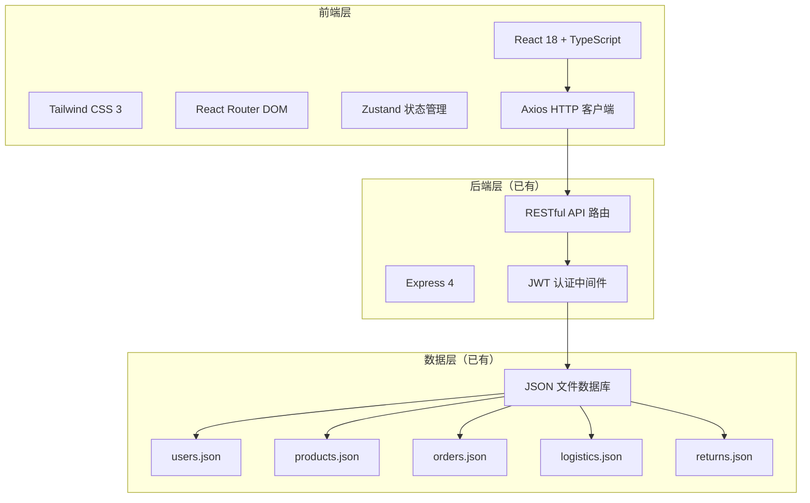
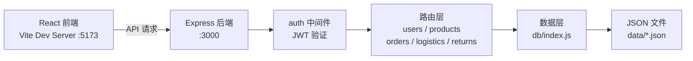
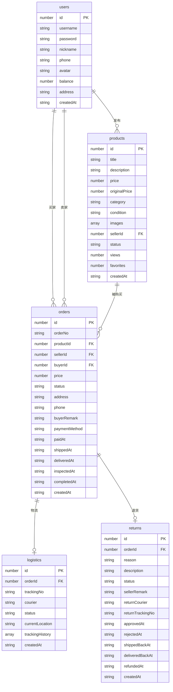

## 1. 架构设计

## 2. 技术说明

- **前端**：React@18 + TypeScript + Tailwind CSS@3 + Vite
- **初始化工具**：vite-init（react-ts 模板）
- **后端**：Express@4（已有，保留不动）
- **数据库**：JSON 文件存储（已有，保留不动）
- **状态管理**：Zustand
- **路由**：React Router DOM v6
- **HTTP 客户端**：Axios
- **图标库**：lucide-react
- **动效**：CSS transitions + Tailwind 动画类

## 3. 路由定义

| 路由路径 | 页面 | 用途 |
|----------|------|------|
| / | 首页 | 商品列表、搜索、分类 |
| /product/:id | 商品详情页 | 商品信息、购买操作 |
| /publish | 发布闲置 | 商品发布表单 |
| /login | 登录/注册 | 用户认证 |
| /orders | 订单中心 | 买家/卖家订单列表 |
| /order/:id | 订单详情 | 订单状态、物流、操作 |
| /returns | 退货管理 | 退货申请列表 |
| /return/:id | 退货详情 | 退货流程操作 |
| /return/apply/:orderId | 申请退货 | 退货申请表单 |
| /profile | 个人中心 | 用户信息、我的发布 |

## 4. API 定义

### 4.1 用户模块

| 方法 | 路径 | 描述 | 请求体 | 响应 |
|------|------|------|--------|------|
| POST | /api/users/register | 注册 | { username, password, nickname, phone } | { token, user } |
| POST | /api/users/login | 登录 | { username, password } | { token, user } |
| GET | /api/users/profile | 获取个人信息 | — | { id, username, nickname, ... } |
| PUT | /api/users/profile | 更新个人信息 | { nickname, phone, address } | { id, username, nickname, ... } |

### 4.2 商品模块

| 方法 | 路径 | 描述 | 请求体 | 响应 |
|------|------|------|--------|------|
| GET | /api/products | 商品列表 | query: { category, keyword, minPrice, maxPrice, page, limit } | { total, page, limit, list } |
| GET | /api/products/categories | 分类列表 | — | string[] |
| GET | /api/products/my | 我的发布 | — | Product[] |
| GET | /api/products/:id | 商品详情 | — | Product & { seller } |
| POST | /api/products | 发布商品 | { title, category, price, ... } | Product |
| PUT | /api/products/:id | 更新商品 | { title, ... } | Product |
| DELETE | /api/products/:id | 删除商品 | — | { message } |

### 4.3 订单模块

| 方法 | 路径 | 描述 | 请求体 | 响应 |
|------|------|------|--------|------|
| GET | /api/orders | 订单列表 | query: { status, role } | Order[] |
| GET | /api/orders/:id | 订单详情 | — | Order & { product, seller, buyer, logistics } |
| POST | /api/orders | 创建订单 | { productId, address, phone, buyerRemark } | Order |
| POST | /api/orders/:id/pay | 支付 | — | Order |
| POST | /api/orders/:id/ship | 发货 | { trackingNo, courier } | Order |
| POST | /api/orders/:id/confirm-delivery | 确认收货 | — | Order |
| POST | /api/orders/:id/inspect | 验货 | { passed, inspectionRemark } | Order |
| POST | /api/orders/:id/complete | 确认完成 | — | Order |
| POST | /api/orders/:id/cancel | 取消订单 | — | Order |

### 4.4 退货模块

| 方法 | 路径 | 描述 | 请求体 | 响应 |
|------|------|------|--------|------|
| GET | /api/returns | 退货列表 | query: { status, role } | Return[] |
| GET | /api/returns/:id | 退货详情 | — | Return & { order, product } |
| POST | /api/returns/order/:orderId | 申请退货 | { reason, description } | Return |
| POST | /api/returns/:id/approve | 同意退货 | { remark } | Return |
| POST | /api/returns/:id/reject | 拒绝退货 | { reason } | Return |
| POST | /api/returns/:id/ship-back | 退回发货 | { trackingNo, courier } | Return |
| POST | /api/returns/:id/confirm-receipt | 确认签收 | — | Return |
| POST | /api/returns/:id/refund | 确认退款 | — | { message, order } |

## 5. 服务器架构图

## 6. 数据模型

### 6.1 数据模型定义

### 6.2 数据定义

已有 JSON 文件数据库，无需创建 SQL DDL。初始数据通过前端 `initSampleData` 函数自动填充。
